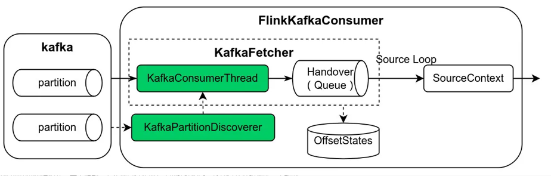
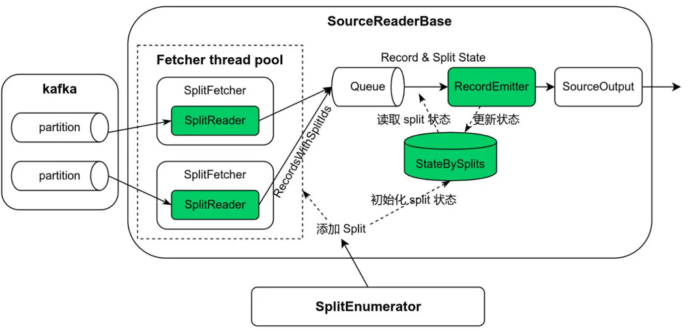

## 新版 Connector

SourceFunction -> Source

### SourceFunction


```java
public class ExampleCountSource implements SourceFunction<Long>, CheckpointedFunction {
    private long count = 0L;
    private volatile boolean isRunning = true;

    private transient ListState<Long> checkpointedCount;

    public void run(SourceContext<T> ctx) {
        while (isRunning && count < 1000) {
            // this synchronized block ensures that state checkpointing,
            // internal state updates and emission of elements are an atomic operation
            synchronized (ctx.getCheckpointLock()) {
                ctx.collect(count);
                count++;
            }
        }
    }

    public void cancel() {
        isRunning = false;
    }

    //模拟 初始化checkpoint
    public void initializeState(FunctionInitializationContext context) {
        this.checkpointedCount = context
                .getOperatorStateStore()
                .getListState(new ListStateDescriptor<>("count", Long.class));

        if (context.isRestored()) {
            for (Long count : this.checkpointedCount.get()) {
                this.count += count;
            }
        }
    }

    //模拟checkpoint提交
    public void snapshotState(FunctionSnapshotContext context) {
        this.checkpointedCount.clear();
        this.checkpointedCount.add(count);
    }
}
```
我们可以发现，这种开发模式存在如下不足：

1. 首先对于批模式和流模式需要不同的处理逻辑，不符合批流融合的业界趋势。
2. 数据分片（例如 kafka partition、file source 的文件 split）和实际数据读取逻辑混合在 SourceFunction 中，导致复杂的实现。
3. 数据分片在接口中并不明确，这使得很难以独立于 source 的方式实现某些功能，例如事件时间对齐（event-time alignment）、分区 watermarks（per-partition watermarks）、动态数据分片分配、工作窃取（work stealing）。
4. 没有更好的方式来优化 Checkpoint 锁，在锁争用下，一些线程（例如 checkpoint 线程）可能无法获得锁。
5. 没有通用的构建模式，每个源都需要实现自行实现复杂的线程模型，这使得开发和测试一个新的 source 变得困难，也提高了开发者对现有 source 的作出贡献的门槛。
有鉴于此，Flink 社区提出了 FLIP-27 [9] 的改进计划，并在 Flink 1.12 实现了基础框架，在 Flink 1.13 中 kafka、hive 和 file source 已移植到新架构，开源社区的 Flink CDC connector 2.0 [11] 也基于新架构实现。

### Source
